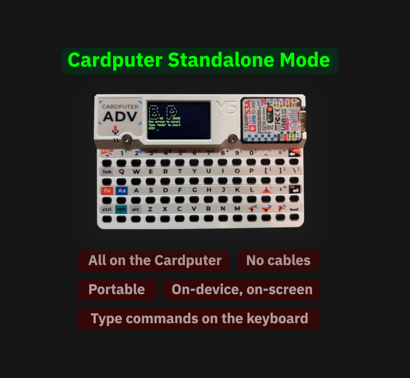
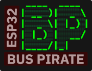

# ESP32 Bus Pirate


**ESP32 Bus Pirate** is an open-source firmware that turns your device into a multi-protocol hacker's tool, inspired by the [legendary Bus Pirate](https://buspirate.com/).

It supports sniffing, sending, scripting, and interacting with various digital protocols (I2C, UART, 1-Wire, SPI, etc.) via a serial terminal or web-based CLI. It also communicates with radio protocols like Bluetooth, Wi-Fi, Sub-GHz and RFID.

Use the [ESP32 Bus Pirate Web Flasher](https://geo-tp.github.io/ESP32-Bus-Pirate/webflasher/) to install the firmware in one click. See the [Wiki](https://github.com/geo-tp/ESP32-Bus-Pirate/wiki) for step-by-step guides on every mode and command. Check [ESP32 Bus Pirate Scripts](https://github.com/geo-tp/ESP32-Bus-Pirate-Scripts) for a collection of scripts.


## Features

- Interactive command-line interface (CLI) via **USB Serial or WiFi Web**.
- **Modes for:**
   - [HiZ](https://github.com/geo-tp/ESP32-Bus-Pirate/wiki/01-HiZ) (default)
   - [I2C](https://github.com/geo-tp/ESP32-Bus-Pirate/wiki/05-I2C) (scan, glitch, slave mode, dump, eeprom)
   - [SPI](https://github.com/geo-tp/ESP32-Bus-Pirate/wiki/06-SPI) (eeprom, flash, sdcard, slave mode)
   - [UART](https://github.com/geo-tp/ESP32-Bus-Pirate/wiki/03-UART) / [Half-Duplex UART](https://github.com/geo-tp/ESP32-Bus-Pirate/wiki/04-HDUART) (bridge, read, write)
   - [1WIRE](https://github.com/geo-tp/ESP32-Bus-Pirate/wiki/02-1WIRE) (ibutton, eeprom)
   - [2WIRE](https://github.com/geo-tp/ESP32-Bus-Pirate/wiki/07-2WIRE) (sniff, smartcard) / [3WIRE](https://github.com/geo-tp/ESP32-Bus-Pirate/wiki/08-3WIRE) (eeprom)
   - [DIO](https://github.com/geo-tp/ESP32-Bus-Pirate/wiki/09-DIO) (Digital I/O, read, pullup, set, pwm)
   - [Infrared](https://github.com/geo-tp/ESP32-Bus-Pirate/wiki/11-INFRARED) (device-b-gone, universal remote)
   - [USB](https://github.com/geo-tp/ESP32-Bus-Pirate/wiki/12-USB) (HID, mouse, keyboard, gamepad, storage)
   - [Bluetooth](https://github.com/geo-tp/ESP32-Bus-Pirate/wiki/13-BLUETOOTH) (BLE HID, scan, spoofing, sniffing)
   - [Wi-Fi](https://github.com/geo-tp/ESP32-Bus-Pirate/wiki/14-WIFI) / [Ethernet](https://github.com/geo-tp/ESP32-Bus-Pirate/wiki/18-ETHERNET) (sniff, deauth, nmap, netcat)
   - [JTAG](https://github.com/geo-tp/ESP32-Bus-Pirate/wiki/15-JTAG) (scan pinout, SWD)
   - [LED](https://github.com/geo-tp/ESP32-Bus-Pirate/wiki/10-LED) (animations, set LEDs)
   - [I2S](https://github.com/geo-tp/ESP32-Bus-Pirate/wiki/16-I2S) (test speakers, mic, play sound)
   - [CAN](https://github.com/geo-tp/ESP32-Bus-Pirate/wiki/17-CAN) (sniff, send and receive frames)
   - [SUBGHZ](https://github.com/geo-tp/ESP32-Bus-Pirate/wiki/19-SUBGHZ) (sniff, scan, replay)
   - [RFID](https://github.com/geo-tp/ESP32-Bus-Pirate/wiki/20-RFID) (read, write, clone)
   - [RF24](https://github.com/geo-tp/ESP32-Bus-Pirate/wiki/21-RF24) (scan, sniff)


- **Protocol sniffers** for I2C, SPI, 1Wire, 2wire, CAN, Wi-Fi, Bluetooth, SubGhz.
- Baudrate **auto-detection**, AT commands and various tools for UART.
- Registers manipulation, **EEPROM dump tools**, identify devices for I2C.
- Read all sort of **EEPROM, Flash** and various others tools for SPI.
- Scripting using **Bus Pirate-style bytecode** instructions or **Python**.
- Device-B-Gone command with more than **80 supported INFRARED protocols**.
- Direct I/O management, **PWM, servo**, pulse.
- Analyze radio signals and frequencies **on every bands**.
- Near than **50 addressable LEDs protocols** supported.
- **Ethernet and WiFi** are supported to access networks.
- Import and export data with the **LittleFS over HTTP.**

## Supported Devices


| Device               |                                     | Description                       |
|-----------------------|------------------------------------------|---------------------------------------------------|
| **ESP32 S3 Dev Kit**  |      | More than 20 available GPIO, 1 button |
| **M5 Cardputer**      |             | 2 GPIO (Grove), screen, keyboard, mic, speaker, IR TX, SD card, [standalone mode](#standalone-mode-for-the-cardputer)            |
| **M5 Cardputer ADV**  |     | 12 GPIO (Grove, Header), screen, keyboard, mic, speaker, IR TX, SD card, IMU, [standalone mode](#standalone-mode-for-the-cardputer)                  |
| **M5 Stick C Plus 2** |       | 5 GPIO (Grove, Header), screen, mic, buzzer, IR TX, IMU, 3 buttons                     |
| **M5 StampS3**        |              | 9 GPIO (exposed pins), 1 button                       |
| **M5 AtomS3 Lite**    |             | 8 GPIO (Grove, Header), IR TX, 1 buttton                     |
| **LILYGO T-Embed**    |           | 9 GPIO (Grove, Header), screen, encoder, speaker, mic, SD card                                           |
| **LILYGO T-Embed CC1101** |  | 4 GPIO (2x Qwiic), screen, encoder, speaker, mic, SD Card, CC1101, PN532, IR TX, IR RX                                   |
| **Seeed Studio Xiao S3** |         | 9 GPIO (exposed pins), 1 button        

- **Other ESP32-S3-based Boards**

  - All boards based on the **ESP32-S3 can be supported**, provided they have at least **8 MB of flash.**

  - You can **flash the s3 dev-kit firmware onto any ESP32-S3 board.**

  - Keep in mind that the **default pin mapping in the firmware may not match** your specific board.

## Getting Started


1. 🔧 Flash the firmware  
   - Use the [ESP32 Bus Pirate Web Flasher](https://geo-tp.github.io/ESP32-Bus-Pirate/webflasher/) to burn the firmware directly from a web browser.
   - You can also burn it on [M5Burner](https://docs.m5stack.com/en/download), in the M5stick, AtomS3, M5StampS3 or Cardputer category.

2. 🔌 Connect via Serial or Web
   - Serial: any terminal app (see [Connect via Serial](https://github.com/geo-tp/ESP32-Bus-Pirate/wiki/99-Serial))
   - Web: configure Wi-Fi and access the CLI via browser (see [Wi-Fi Connection](https://github.com/geo-tp/ESP32-Bus-Pirate/wiki/00-Terminal))

3. 🧪 Use commands like:
   ```bash
   mode
   help
   scan
   sniff
   ...
    ```

## Wiki


📚 Visit the **[Wiki](https://github.com/geo-tp/ESP32-Bus-Pirate/wiki)** for detailed documentation on every mode and command.

Includes:
- [Terminal mode](https://github.com/geo-tp/ESP32-Bus-Pirate/wiki/00-Terminal) - About serial and web terminal.
- [Mode overviews](https://github.com/geo-tp/ESP32-Bus-Pirate/wiki) - Browse supported modes.
- [Instruction syntax](https://github.com/geo-tp/ESP32-Bus-Pirate/wiki/99-Instructions) - Master the instructions.
- [Serial setup](https://github.com/geo-tp/ESP32-Bus-Pirate/wiki/99-Serial) - Serial access via USB.

The wiki is the best place to learn how everything works.

## Scripting


🛠️ You can [automate interactions with the ESP32 Bus Pirate](https://github.com/geo-tp/ESP32-Bus-Pirate/wiki/99-Python) using **Python scripts over serial.**

**Examples and ready-to-use scripts** are available in the repository: [ESP32 Bus Pirate Scripts](https://github.com/geo-tp/ESP32-Bus-Pirate-Scripts).

**Including:** Logging data in a file, eeprom and flash dump, interracting with GPIOs, LED animation...
   
## ESP32 Bus Pirate on M5 Devices


## ESP32 Bus Pirate on T-Embed


## Command-Line Interfaces

The ESP32 Bus Pirate firmware provides three command-line interface (CLI) modes:

| Interface         | Advantages                                                                 | Ideal for...                          |
|------------------|-----------------------------------------------------------------------------|----------------------------------------|
| **Web Interface** | - Accessible from any browser<br>- PC, tablets, mobiles<br>- Works over Wi-Fi<br>- No cables needed | Quick tests, demos, headless setups   |
| **Serial Interface** | - Faster performance<br>- Instant responsiveness<br>- Handles large data smoothly | Intensive sessions, frequent interactions |
| **Standalone** | - Only for the Cardputer<br>- On device keyboard<br>- On device screen | Portable sessions, Quick tests |


All interfaces share the same command structure and can be used interchangeably ([more details](https://github.com/geo-tp/ESP32-Bus-Pirate/wiki/00-Terminal)).

## Mobile Web Interface over WiFi


## Standalone Mode for the Cardputer


## Using the ESP32 Bus Pirate to speak UART over WiFi


## Contribute
See [How To Contribute](https://github.com/geo-tp/ESP32-Bus-Pirate/wiki/99-Contribute) section, which outlines a **simple way to add a new command** to any mode.

## Visuals Assets

#### 

See [images, logo, presentations, photo, video, illustrations](https://github.com/geo-tp/ESP32-Bus-Pirate/wiki/99-Visual-Assets). These visuals can be **freely used in blog posts, documentation, videos, or articles** to help explain and promote the firmware.


## Warning
> ⚠️ **Voltage Warning**: Devices should only operate at **3.3V** or **5V**.  
> - Do **not** connect peripherals using other voltage levels — doing so may **damage your ESP32**.

> ⚠️ **Usage Warning**: This firmware is provided for **educational, diagnostic, and interoperability testing purposes only**.
> - Do not use it to interfere with, probe, or manipulate devices without proper authorization.
> - Avoid any unauthorized RF transmissions (e.g., sub-GHz) that could violate local regulations or disrupt networks and communications.
> - The authors are not responsible for any misuse of this software or hardware, including legal consequences resulting from unauthorized access or signal emission.
> - Always stay within the bounds of your country’s laws and responsible disclosure policies.


